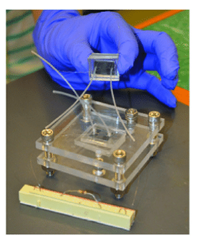

### Introduction
Conventional microbial biofuel cells (MFC) use enzymes or microorganisms to convert the chemical energy of a fuel (usually alcohol or carbohydrates) into electric power. Different biofuel cells encompass diverse applications based on their unique design and operational characteristics. Some prevalent MFCs that facilitate the transfer of electrons between the electrodes with catalytic organisms are mediator MFCs, mediator-free MFCs, and soil-based MFCs. Each type of fuel cell exhibits varying efficiency ranges depending on factors such as substrate composition, microbial communities, and system configuration, which gain the versatility and potential of MFC technology in sustainable energy production. Also, the biofuel cells based on macroscale diffusion chambers separated by different proton exchange chambers have mass transfer limitations and restricted portability. Microfluidic microbial fuel cells (MMFCs) represent a cutting-edge technology at the intersection of microfluidics and bioenergy. The microfluidic structure of the device can enhance performance by minimising internal resistance and achieving a relatively high-power density compared to traditional MFC designs.

### Theory
Microfluidic microbial fuel cells (MMFCs) are an innovative approach to sustainable energy generation, particularly suited for powering ultra-small electronic devices in the future. Recent advancements in MMFCs have led to faster start-up times, increased power density, and improved performance. Developing such micro-design devices is crucial for addressing the urgent need for sustainable energy sources in the current era. The potential application areas of these miniaturised fuel cells include portable communication and transportation systems, lab-on-a-chip diagnostic devices and integrated (bio)chemical sensors. By leveraging microfluidic principles, MMFCs offer several advantages, including efficient utilisation of resources, cost-effectiveness, and reduced environmental impact.

Blending microfluidic technology with the microbial fuel cell has opened new possibilities for improving power-generating efficiency. To enhance mass transport and facilitate effective delivery of substrates to microbial biofilms on the electrodes, microfluidic microbial fuel cells (MFCs) employ precise control over fluid flow dynamics. Microfluidic platforms provide customised electrode designs to enhance electron transfer kinetics, promoting proximity between bacteria and electrodes. Microfluidic systems offer significant contributions to understanding biofilm growth and electron transfer mechanisms within microbial fuel cells (MFCs) and their role in power generation enhancement. These platforms allow for the immediate observation and analysis of the growth patterns of biofilms, providing insights into the structure and spatial arrangement of biofilms. Furthermore, microfluidic configurations offer accurate control of environmental parameters, enabling researchers to investigate the impact of variables such as nutrient accessibility and substrate concentration on the efficiency of microbial fuel cells (MFCs). Microfluidic MFCs provide enhanced power generation efficiency and serve as essential instruments for understanding the intricacies of microbial electrochemical systems.

### Design of Microfluidic Microbial Fuel Cell (MMFC)
The design and construction of Microfluidic Microbial Fuel cells focus on maximising power generation efficiency by optimising fluid dynamics, electrode configuration, and operational parameters within a microfluidic environment. MMFCs with proton exchange membranes (PEMs) are designed to facilitate efficient electron transfer while preventing the mixing of fuel and oxidant streams. The design typically involves:

#### *Microchannel Architecture:*####
MMFCs feature intricate microchannel networks that control fuel and oxidant flow. These channels are designed to optimise mass transport to the electrodes while minimising the crossover of reactants, enhancing efficiency.

#### *Integration of Proton Exchange Membrane:* 
A PEM is incorporated into the MMFC design to separate the anodic and cathodic compartments. This membrane selectively allows protons to pass through while blocking the flow of gases and liquids, enabling proton transport and maintaining electrical neutrality.

#### *Electrode Configuration:* 
Anode and cathode electrodes are positioned within the microfluidic system, typically using conductive materials like carbon cloth or graphite. These electrodes provide a surface for electrochemical reactions to occur and facilitate electron transfer.

#### *Fluid Flow Control:* 
Some MMFC designs incorporate features for precise control of fluid flow, such as microvalves or pumps. These components regulate the flow rates of fuel and oxidant, optimizing operational parameters and improving power generation efficiency.

By integrating these elements, MMFCs with PEMs offer a compact and efficient platform for generating electricity from microbial activity while maintaining separation between the reactants, thereby enhancing performance and longevity.

&nbsp;

*Adapted from: Vigolo, D., Al-Housseiny, T. T., Shen, Y., Akinlawon, F. O., Al-Housseiny, S. T., Hobson, R. K., & Stone, H. A. (2014). Flow dependent performance of microfluidic microbial fuel cells. Physical Chemistry Chemical Physics, 16(24), 12535-12543.*

### Advantages of using Microfluidic Microbial cell (MMFC) over a conventional MFC

The integration of microfluidics into MFC technology represents a significant advancement, enabling both enhanced power generation efficiency and in-depth exploration of biofilm dynamics and electron transfer mechanisms within MFCs. This interdisciplinary approach holds promise for further innovations in sustainable energy production and bio electrochemical research. MMFC offers some unique advantages in several key areas:

#### *Energy Sustainability:* 
With the growing demand for clean and renewable energy sources, Microfluidic MFCs provide a promising solution. By harnessing microbial activity to generate electricity from organic substrates, they contribute to sustainable energy production.

#### *Resource Efficiency:* 
Microfluidic MFCs utilize minimal resources and operate under ambient conditions, making them energy-efficient and cost-effective compared to traditional energy production methods. This efficiency is crucial for reducing resource consumption and environmental impact.

#### *Wastewater Treatment:* 
In the era of water scarcity and pollution, Microfluidic MFCs offer a dual benefit of wastewater treatment and energy generation. They can efficiently degrade organic pollutants in wastewater while producing electricity, addressing two pressing global challenges simultaneously.

#### *Remote Applications:* 
Microfluidic MFCs are suitable for remote and off-grid locations where access to traditional power sources is limited. These devices can provide sustainable power for remote monitoring systems, environmental sensors, and other applications in remote areas.

#### *Biomedical Innovations:* 
In the field of biotechnology and medical devices, Microfluidic MFCs offer potential applications in implantable devices, biosensors, and drug delivery systems. Their compact size, biocompatibility, and ability to generate power from biological substrates make them promise for various biomedical applications.
