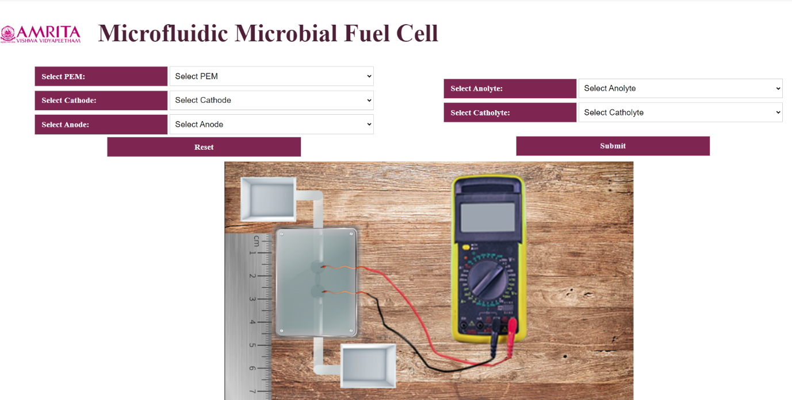
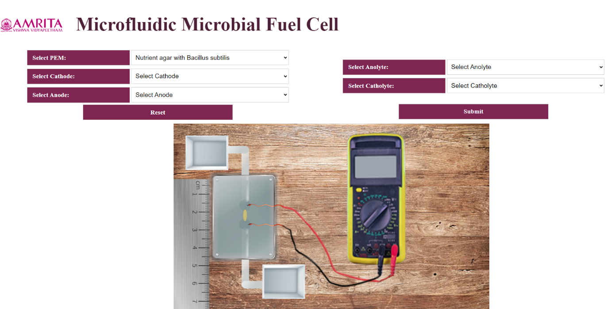
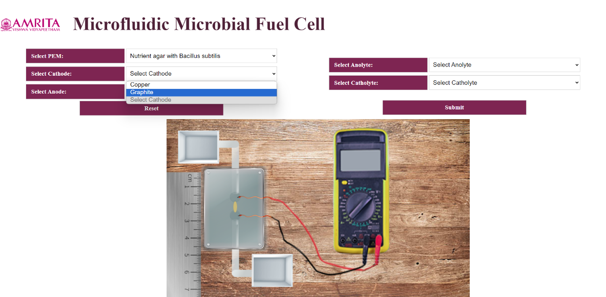
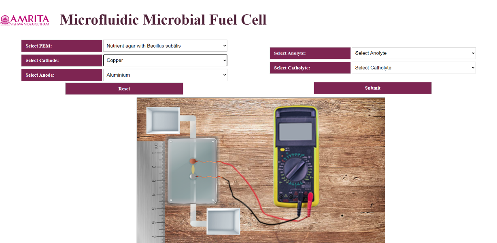
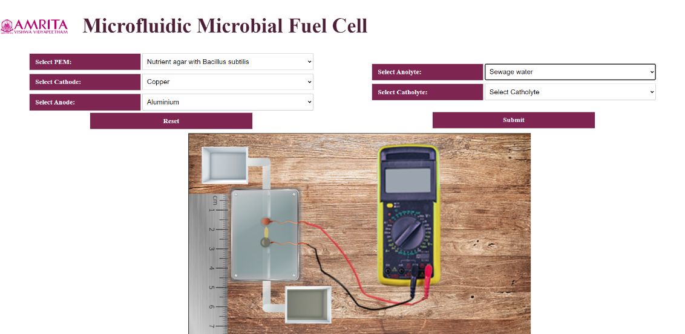
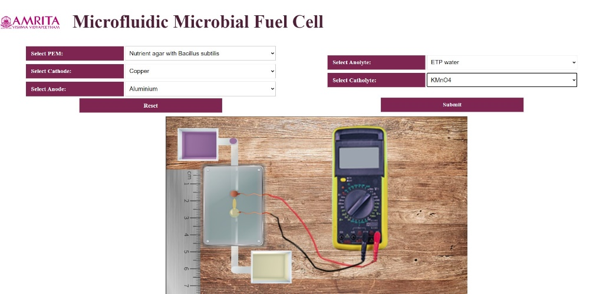
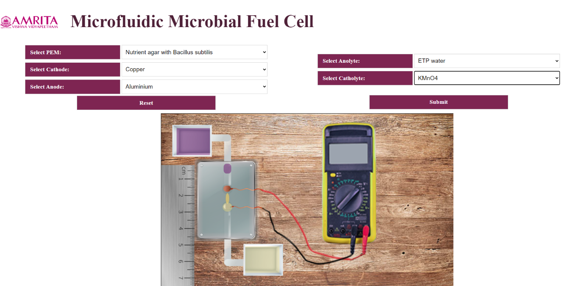
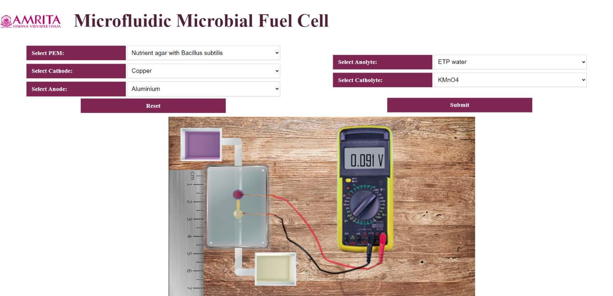
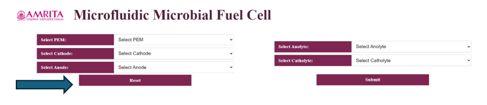

### Procedure

1. Users can open the simulator window. The GUI has selection choices for input parameters such as PEM selection, Anolyte selection, Catholyte selection and electrodes (anode and cathode) selection. Users can change the parameters by clicking on the specific tabs. In this experiment, a measuring scale is given to show the microstructure construction of microfluidic biofuel cell. Also, the MMFC is connected to a voltmeter to measure the voltage and to ensure bioelectricity production.

&nbsp;

2. The user can select the PEM as Nutrient agar with Bacillus Subtilis from the GUI.

&nbsp;

3. The GUI has two options for Cathode and Anode selection: Copper and Graphite as cathode and Aluminium and Graphite as Anode. Users can select their choice of parameter. Once the user selects copper as cathode, simultaneously Aluminium will selected as anode. Like wise If the user selected Graphite as cathode, the GUI auto selected Graphite as anode.

&nbsp;

&nbsp;

&nbsp;

4. In the simulator include two selections for anolyte selection: Sewage water and ETP water. 

&nbsp;

&nbsp;

5. The user can select KMnO4 as catholyte from the simulator.

&nbsp;

6. To work out the simulator, as an example, User can select PEM as Nutrient agar with Bacillus subtilis, Cathode as Copper, Aluminium as anode, ETP water as anolyte and KMnO4 as catholyte. Once user provide all the parameters, a micro amount of ETP water were transferred to the microfluidic chamber which is visible in the GUI. When the ETP water reached the biofuel chamber, click on the submit button and a bioelectricity of 0.091 V is produced which is visible from the voltmeter.

&nbsp;

&nbsp;

7. To redo the experiment, click on the Reset button and provide users choice of parameters and measure the amount of bioelectricity produced from a Microfluidic Microbial fuel cell.

&nbsp;